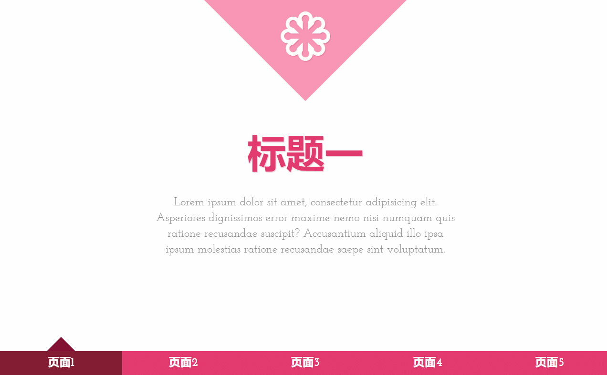

# CSS3实现的页面平滑效果
    效果如下：

tretret
    css代码
```angularjs
@font-face {
    font-family: "Raphaelicons";
    src:url("../fonts/raphaelicons-webfont.eot") format('eot'),
        url("../fonts/raphaelicons-webfont.woff") format("woff"),
        url("../fonts/raphaelicons-webfont.svg") format("svg"),
        url("../fonts/raphaelicons-webfont.ttf") format("truetype");
    font-weight: normal;
    font-style: normal;

}
body{
    font-family: Georgia,Serif;
    background: #ddd;
    font-weight: 400;
    font-size: 15px;
    color:#333;
    overflow: hidden;
    -webkit-font-smoothing: antialiased;
    font-smoothing: antialiased;
    /*CSS抗锯齿 font-smoothing 属性介绍*/
    /*CSS3里面加入了一个“-webkit-font-smoothing”属性。*/
    /*这个属性可以使页面上的字体抗锯齿,使用后字体看起来会更清晰舒服。*/
    /*加上之后就顿时感觉页面小清晰了。 淘宝也在用哦！*/
    /*它有三个属性：*/
    /*none                                     ------ 对低像素的文本比较好*/
    /*subpixel-antialiased                ------默认值*/
    /*antialiased                             ------抗锯齿很好*/

}
a{
    text-decoration: none;
    color:#555;
}
.clr{
    width: 0;
    height: 0;
    overflow: hidden;
    clear: both;
    padding: 0;
    margin: 0;
}
.st-container{
    width: 100%;
    height: 100%;
    position: absolute;
    left: 0;
    top: 0;
    font-family: "Josefin Slab","Myrid Pro",Arial,sans-serif;
}
.st-container>input,
.st-container>a{
    width: 20%;
    height: 34px;
    line-height: 34px;
    position: fixed;
    bottom: 0;
    cursor: pointer;
}
.st-container>input{
    opacity: 0;
    z-index: 1000;
}
.st-container>a{
    z-index: 10;
    font-weight: 700;
    font-size: 16px;
    background: #e23a6e;
    text-align: center;
    color:#fff;
    text-shadow:1px 1px 1px rgba(151,24,64,0.2);
}
#st-control-1,#st-control-1+a{
    left: 0%;
}
#st-control-2,#st-control-2+a{
    left: 20%;
}
#st-control-3,#st-control-3+a{
    left: 40%;
}
#st-control-4,#st-control-4+a{
    left: 60%;
}
#st-control-5,#st-control-5+a{
    left: 80%;
}
.st-container input:checked+a,
.st-container input:checked:hover+a{
    background: #821e34;
}
.st-container input:checked+a:after{
    content: "";
    width: 0;
    height: 0;
    overflow: hidden;
    border:20px solid transparent;
    border-bottom-color: #821134;
    position: absolute;
    bottom: 100%;
    left: 50%;
    margin-left:-20px;
}
.st-container input:hover+a{
    background: #ad244f;
}
/*内容*/
.st-scroll,
.st-panel{
    width: 100%;
    height: 100%;
    position:relative;
}
.st-scroll{
    left: 0;
    top: 0;
    -webkit-transform: translate3d(0,0,0);
    -moz-transform: translate3d(0,0,0);
    -ms-transform: translate3d(0,0,0);
    -o-transform: translate3d(0,0,0);
    transform: translate3d(0,0,0);
    -webkit-backface-visibility: hidden;
    -moz-backface-visibility: hidden;
    -ms-backface-visibility: hidden;
    backface-visibility: hidden;
    -webkit-transition: all 0.6s ease-in-out;
    -moz-transition: all  0.6s ease-in-out;
    -ms-transition: all  0.6s ease-in-out;
    -o-transition: all  0.6s ease-in-out;
    transition: all  0.6s ease-in-out;
}
.st-panel{
    background: #fff;
    overflow: hidden;
}
#st-control-1:checked~.st-scroll{
    -webkit-transform: translateY(0%);
    -moz-transform: translateY(0%);
    -ms-transform: translateY(0%);
    -o-transform: translateY(0%);
    transform: translateY(0%);
}
#st-control-2:checked~.st-scroll{
    -webkit-transform: translateY(-100%);
    -moz-transform: translateY(-100%);
    -ms-transform: translateY(-100%);
    -o-transform: translateY(-100%);
    transform: translateY(-100%);
}
#st-control-3:checked~.st-scroll{
    -webkit-transform: translateY(-200%);
    -moz-transform: translateY(-200%);
    -ms-transform: translateY(-200%);
    -o-transform: translateY(-200%);
    transform: translateY(-200%);
}
#st-control-4:checked~.st-scroll{
    -webkit-transform: translateY(-300%);
    -moz-transform: translateY(-300%);
    -ms-transform: translateY(-300%);
    -o-transform: translateY(-300%);
    transform: translateY(-300%);
}
#st-control-5:checked~.st-scroll{
    -webkit-transform: translateY(-400%);
    -moz-transform: translateY(-400%);
    -ms-transform: translateY(-400%);
    -o-transform: translateY(-400%);
    transform: translateY(-400%);
}
.st-desc{
    width: 200px;
    height: 200px;
    background: #fa96b5;
    position: absolute;
    top: 0;
    left:50%;
    margin-left:-100px;
    -webkit-transform: translateY(-50%) rotate(45deg);
    -moz-transform: translateY(-50%) rotate(45deg);
    -ms-transform: translateY(-50%) rotate(45deg);
    -o-transform: translateY(-50%) rotate(45deg);
    transform: translateY(-50%) rotate(45deg);
}
[data-icon]:after{
    content: attr(data-icon);
    width: 200px;
    height: 200px;
    /*background: #0f0;*/
    color:#fff;
    font-size: 90px;
    text-align: center;
    line-height: 200px;
    position:absolute;
    left: 50%;
    top: 50%;
    margin:-100px 0 0 -100px;
    -webkit-transform: rotate(-45deg) translateY(25%);
    -moz-transform: rotate(-45deg) translateY(25%);
    -ms-transform: rotate(-45deg) translateY(25%);
    -o-transform: rotate(-45deg) translateY(25%);
    transform: rotate(-45deg) translateY(25%);
    font-family: "Raphaelicons";
    text-shadow:1px 1px 1px rgba(151,24,64,0.2);
}
.st-panel h2{
    color:#e23a6e;
    font-size: 54px;
    line-height: 54px;
    text-align: center;
    font-weight: 900;
    width: 80%;
    position: absolute;
    left: 10%;
    top: 50%;
    margin-top:-70px;
    text-shadow:1px 1px 1px rgba(151,24,64,0.2);
    -webkit-backface-visibility: hidden;
    -moz-backface-visibility: hidden;
    -ms-backface-visibility: hidden;
    backface-visibility: hidden;
}
#st-control-1:checked ~ .st-scroll #st-panel-1 h2,
#st-control-2:checked ~ .st-scroll #st-panel-2 h2,
#st-control-3:checked ~ .st-scroll #st-panel-3 h2,
#st-control-4:checked ~ .st-scroll #st-panel-4 h2,
#st-control-5:checked ~ .st-scroll #st-panel-5 h2
{
    -webkit-animation: moveDown 0.6s ease-in-out 0.2s backwards;
    -o-animation: moveDown 0.6s ease-in-out 0.2s backwards;
    animation: moveDown 0.6s ease-in-out 0.2s backwards;
}
@keyframes moveDown {
    0%{
        transform: translateY(-40px);
        opacity: 0;
    }
    100%{
        transform: translateY(0px);
        opacity: 1;
    }
}
@-moz-keyframes moveDown {
    0%{
        -moz-transform: translateY(-40px);
        opacity: 0;
    }
    100%{
        -moz-transform: translateY(0px);
        opacity: 1;
    }
}
@-ms-keyframes moveDown {
    0%{
        -ms-transform: translateY(-40px);
        opacity: 0;
    }
    100%{
        -ms-transform: translateY(0px);
        opacity: 1;
    }
}
@-o-keyframes moveDown {
    0%{
        -o-transform: translateY(-40px);
        opacity: 0;
    }
    100%{
        -o-transform: translateY(0px);
        opacity: 1;
    }
}
@-webkit-keyframes moveDown {
    0%{
        -webkit-transform: translateY(-40px);
        opacity: 0;
    }
    100%{
        -webkit-transform: translateY(0px);
        opacity: 1;
    }
}
.st-panel p{
    position: absolute;
    width: 50%;
    left: 25%;
    top: 50%;
    font-size: 16px;
    line-height: 22px;
    padding: 0;
    text-align: center;
    color:#8b8b8b;
    -webkit-backface-visibility: hidden;
    -moz-backface-visibility: hidden;
    -ms-backface-visibility: hidden;
    backface-visibility: hidden;
    margin-top: 10px;
}
#st-control-1:checked ~ .st-scroll #st-panel-1 p,
#st-control-2:checked ~ .st-scroll #st-panel-2 p,
#st-control-3:checked ~ .st-scroll #st-panel-3 p,
#st-control-4:checked ~ .st-scroll #st-panel-4 p,
#st-control-5:checked ~ .st-scroll #st-panel-5 p{
    -webkit-animation: moveUp 0.6s ease-in-out backwards;
    -o-animation: moveUp 0.6s ease-in-out backwards;
    animation: moveUp 0.6s ease-in-out backwards;
}
@keyframes moveUp {
    0%{
        transform: translateY(40px);
        opacity: 0;
    }
    100%{
        transform: translateY(0px);
        opacity: 1;
    }
}
@-webkit-keyframes moveUp {
    0%{
        -webkit-transform: translateY(40px);
        opacity: 0;
    }
    100%{
        -webkit-transform: translateY(0px);
        opacity: 1;
    }
}
@-ms-keyframes moveUp {
    0%{
        -ms-transform: translateY(40px);
        opacity: 0;
    }
    100%{
        -ms-transform: translateY(0px);
        opacity: 1;
    }
}
@-o-keyframes moveUp {
    0%{
        -o-transform: translateY(40px);
        opacity: 0;
    }
    100%{
        -o-transform: translateY(0px);
        opacity: 1;
    }
}
@-moz-keyframes moveUp {
    0%{
        -moz-transform: translateY(40px);
        opacity: 0;
    }
    100%{
        -moz-transform: translateY(0px);
        opacity: 1;
    }
}
.st-color{
    background: #fa96b5;
}
.st-color .st-desc{
    background:#fff;
}
.st-color [data-icon]:after{
    color:#fa96b5;
}
.st-color h2{
    color:#fff;
    text-shadow:1px 1px 1px rgba(151,24,64,0.2);
}
.st-color p{
    color:rgba(255,255,255,0.8);
}
@media screen and (max-width: 520px){
    .st-panel h2{
        font-size: 42px;
    }
    .st-panel p{
        width: 90%;
        left: 10%;
        margin-top: 0;
    }
    .st-container > a{
        font-size: 13px;
    }
}
@media screen and (max-width: 360px){
    .st-panel h2{
        font-size: 42px;
    }
    .st-panel p{
        width: 90%;
        left: 10%;
        margin-top: 0;
    }
    .st-container > a{
        font-size: 13px;
    }
    .st-desc{
        width: 120px;
        height: 120px;
        margin-left: -60px;
    }
    [data-icon]:after{
        font-size: 60px;
        -webkit-transform: rotate(-45deg) translateY(15%);
        -moz-transform: rotate(-45deg) translateY(15%);
        -ms-transform: rotate(-45deg) translateY(15%);
        -o-transform: rotate(-45deg) translateY(15%);
        transform: rotate(-45deg) translateY(15%);
    }
}
```    

    html代码
```angularjs
<!DOCTYPE html>
<html lang="en">
<head>
    <meta charset="UTF-8">
    <title>CSS3实现的页面平滑效果</title>
    <meta http-equiv="X-UA-Compatible" content="IE-edge,chrom=1">
    <meta name="viewport" content="width=device-width,initial-scale=1">
    <link rel="stylesheet" href="http://fonts.googleapis.com/css?family=Josefin+Slab:400,700">
    <link rel="stylesheet" href="css/normalize.css">
    <link rel="stylesheet" href="css/style.css">
</head>
<body>
<div class="container">
    <div class="st-container">
        <!--nav-begin-->
        <input type="radio" name="radio-set" checked="checked" id="st-control-1">
        <a href="#st-panel-1">页面1</a>
        <input type="radio" name="radio-set" id="st-control-2">
        <a href="#st-panel-2">页面2</a>
        <input type="radio" name="radio-set"  id="st-control-3">
        <a href="#st-panel-3">页面3</a>
        <input type="radio" name="radio-set"  id="st-control-4">
        <a href="#st-panel-4">页面4</a>
        <input type="radio" name="radio-set" id="st-control-5">
        <a href="#st-panel-5">页面5</a>
        <!--nav-end-content begin-->
        <div class="st-scroll">
            <section class="st-panel" id="st-panel-1">
                <div class="st-desc" data-icon="H"></div>
                <h2>标题一</h2>
                <p>
                    Lorem ipsum dolor sit amet,
                    consectetur adipisicing elit.
                    Asperiores dignissimos error maxime
                    nemo nisi numquam quis ratione recusandae
                    suscipit? Accusantium aliquid illo ipsa ipsum
                    molestias ratione recusandae saepe sint
                    voluptatum.
                </p>
            </section>
            <section class="st-panel st-color" id="st-panel-2">
                <div class="st-desc" data-icon="2"></div>
                <h2>标题二</h2>
                <p>
                    Lorem ipsum dolor sit amet,
                    consectetur adipisicing elit.
                    Asperiores dignissimos error maxime
                    nemo nisi numquam quis ratione recusandae
                    suscipit? Accusantium aliquid illo ipsa ipsum
                    molestias ratione recusandae saepe sint
                    voluptatum.
                </p>
            </section>
            <section class="st-panel" id="st-panel-3">
                <div class="st-desc" data-icon="3"></div>
                <h2>标题三</h2>
                <p>
                    Lorem ipsum dolor sit amet,
                    consectetur adipisicing elit.
                    Asperiores dignissimos error maxime
                    nemo nisi numquam quis ratione recusandae
                    suscipit? Accusantium aliquid illo ipsa ipsum
                    molestias ratione recusandae saepe sint
                    voluptatum.
                </p>
            </section>
            <section class="st-panel st-color" id="st-panel-4">
                <div class="st-desc" data-icon="4"></div>
                <h2>标题四</h2>
                <p>
                    Lorem ipsum dolor sit amet,
                    consectetur adipisicing elit.
                    Asperiores dignissimos error maxime
                    nemo nisi numquam quis ratione recusandae
                    suscipit? Accusantium aliquid illo ipsa ipsum
                    molestias ratione recusandae saepe sint
                    voluptatum.
                </p>
            </section>
            <section class="st-panel" id="st-panel-5">
                <div class="st-desc" data-icon="5"></div>
                <h2>标题五</h2>
                <p>
                    Lorem ipsum dolor sit amet,
                    consectetur adipisicing elit.
                    Asperiores dignissimos error maxime
                    nemo nisi numquam quis ratione recusandae
                    suscipit? Accusantium aliquid illo ipsa ipsum
                    molestias ratione recusandae saepe sint
                    voluptatum.
                </p>
            </section>
        </div>
    </div>
</div>
</body>
</html>
```    

